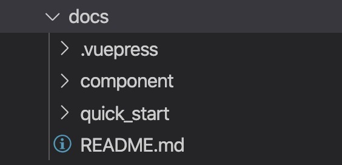

### 1. vuepress的使用(https://www.vuepress.cn/)

### 2. 使用vuepress在同一个项目中管理组件和文档维护

1. 在已有项目内部增加docs文件夹

  - README.md是文档首页内容，必须设置
  - quick_start 首页快速上手，方便跳转到文档链接
  - .vuepress是vuepress必须的配置文件，包含config.js配置文件/样式/静态资源等。
  - component 存放组件库每个组件的md文档
  
      


2. package.json中增加
  ```javascript
    "scripts": {
    "dev": "vuepress dev docs",
    "build": "vuepress build docs"
  },
  ```

3. 当你在主分支完成组件开发，增加该组件的文档之后想要发布到静态服务器上，可以首先npm run build:doc,得到编译后的静态文件

4. 然后在项目根目录运行 sh ./deploy.sh 即可发布静态文件到gh-pages.

### 3.需要特别注意的一点是config.js下base的配置影响发布之后静态文件的访问路径。
比如我的仓库是https://github.com/kellywang1314/vuepresstest/

  1. 我build之后的静态文件都存放在public下，发布到gh-pages的目录形式为public，
   静态文件访问路由为https://kellywang1314.github.io/vuepresstest/public/
   那我的base应该是'/vuepresstest/public/'.

  2. 我build之后的静态文件都存放在根目录下，发布到gh-pages的目录形式为/，
   静态文件访问路由为https://kellywang1314.github.io/vuepresstest/
   那我的base应该是'/vuepresstest/'.


