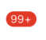

# 徽标Badge

## 资源
[视觉](http://cdp.release.ctripcorp.com/project/sketch/%E3%80%90%E8%87%AA%E7%94%B1%E8%A1%8CUI%E7%BB%84%E4%BB%B6%E5%BA%93%E3%80%91%E5%BE%BD%E6%A0%87/index.html) 张婷 | 开发 冯申翔

## 类型(点击对应图片直接查看相关文档)
| withChildren | [](#withchildren) |
| ------------ | ------------------------------------------------------------ |
| standalone   | [](#standalone) |

## withChildren
### 属性

| 属性名称     | 数据类型                            | 是否必填                      | 备注 |
|----------|-------------------------------|---------------------------|----|
| children | JSX.Element   | 是                         |    |
| num      | number                        | 否                         |    |
| offset   | { top: number, right: number} | 否, 默认: {top: 0, right: 0} |    |
### 使用
```tsx
    <Badge.withChildren
    	offset={
    		top:0,
    		right:0,
    	}
    	num={0}
    >
    	<View>
    		<Text>文字</Text>
    	</View>
    </Badge>
```

## standalone 
| 属性名称 | 类型   | 是否必填 | 备注 |
| -------- | ------ | -------- | ---- |
| num      | number | 否       |      |

### 使用
```tsx
    <Badge.standalone
    	num={0}
    />
```

## 样式

