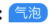
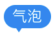
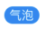

# 气泡Bubble

## 资源
 [视觉](http://cdp.release.ctripcorp.com/project/sketch/%E8%87%AA%E7%94%B1%E8%A1%8Cctrip%E8%A7%86%E8%A7%89%E8%AE%BE%E8%AE%A1%E8%A7%84%E8%8C%83/index.html#artboard8) 张婷 | 开发 冯申翔

## 类型(点击对应图片直接查看相关文档)
|角标大气泡|角标小气泡|通知式小气泡|基础回显型小气泡|
|------------------------------------------------------------------------------------------|------------------------------------------------------------------------------------------|------------------------------------------------------------------------------------------|------------------------------------------------------------------------------------------|
|[](#bigsubscript) | [](#smallsubscript) | [](#notification) | [](#callback) |

## bigSubscript
| 属性名称     | 数据类型                            | 是否必填                      | 备注 |
|----------|-------------------------------|---------------------------|----|
| text | string                     | 是                         |    |
| backgroundColor      | 'red' \| 'orange' \| 'blue' \| 'gray' \| 'white'                | 是                      |    |

### 使用
```tsx
<Bubble.bigSubscript
	text='气泡'
	backgroundColor='blue'
/>
```

## smallSubscript
| 属性名称     | 数据类型                            | 是否必填                      | 备注 |
|----------|-------------------------------|---------------------------|----|
| text | string                     | 是                         |    |
| backgroundColor      | 'red' \| 'orange' \| 'blue' \| 'gray' \| 'white'                        | 是                      |    |

### 使用
```tsx
<Bubble.smallSubscript
	text='气泡'
	backgroundColor='blue'
/>
```

## notification
| 属性名称     | 数据类型                            | 是否必填                      | 备注 |
|----------|-------------------------------|---------------------------|----|
| text | string                     | 是                         |    |
| backgroundColor      | 'red' \| 'orange' \| 'blue' \| 'gray' \| 'white'                        | 是                      |    |

### 使用
```tsx
<Bubble.notification
	text='气泡'
	backgroundColor='blue'
/>
```

## callback
| 属性名称     | 数据类型                            | 是否必填                      | 备注 |
|----------|-------------------------------|---------------------------|----|
| text | *string*                   | 是                         |    |
| backgroundColor      | 'red' \| 'orange' \| 'blue' \| 'gray' \| 'white'                        | 是                      |    |

### 使用
```tsx
<Bubble.callback
	text='气泡'
	backgroundColor='blue'
/>
```
## 样式
