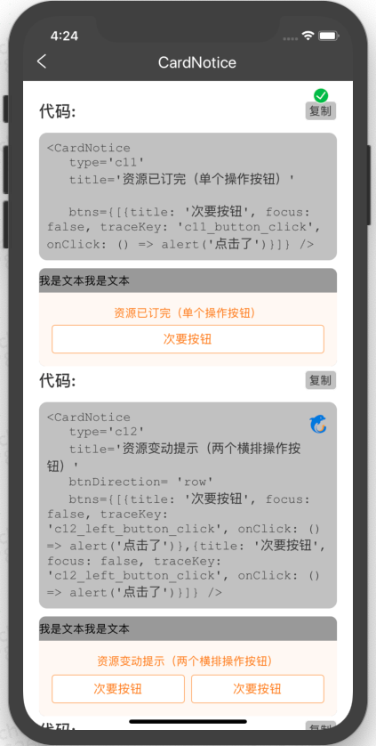

# 卡片提示CardNotice

## 资源
[视觉规范中C1](http://cdp.release.ctripcorp.com/project/sketch/%E4%BF%A1%E6%81%AF%E6%8F%90%E7%A4%BA%E5%88%86%E7%BA%A7UI%E8%A7%84%E8%8C%83/index.html#artboard2) 张婷 | 开发 陈思思

## 使用
```js
import { CardNotice } from '@ctrip/rn-koala'
<CardNotice
	type='c13'
	title='资源变动提示（两个操作按钮并有焦点按钮）'
	btns={[
        {
            title: '焦点按钮强提示',
            focus: true,
            traceKey: 'c13_focus_button_click',
            onClick: () => alert('点击了')
        },
        {
            title: '次要按钮',
            focus: false,
            traceKey: 'c13_unfocus_button_click',
            onClick: () => alert('点击了')
        }
    ]}
/>
```

## API
| 属性         | 说明         | 类型                    | 默认值   | 必选 |
| ------------ | ------------ | ----------------------- | -------- | ---- |
| title        | 卡片提示文字 | string                  |          | 是   |
| btns         | 按钮         | [array](#btnprops)      |          | 是   |
| type         | 卡片提示类型 | 'c11' 或 'c12' 或 'c13' |          | 否   |
| btnDirection | 按钮排列方式 | 'row' 或 'column'       | 'column' | 否   |

### btnProps
```js
btns: {
    title: string,  // 按钮文案
    focus: boolean // 是否是一级按钮
    traceKey?: string // 点击action埋点
    onClick: () => void // 点击事件
}[]
```

## 示例
