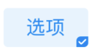

# 复选框Checkbox

## 视觉稿
[视觉](http://cdp.release.ctripcorp.com/project/sketch/%E3%80%90%E8%87%AA%E7%94%B1%E8%A1%8CUI%E7%BB%84%E4%BB%B6%E5%BA%93%E3%80%91%E5%A4%8D%E9%80%89%E6%A1%86/index.html#artboard0) 张婷 | 开发 冯申翔

## 类型(点击对应图片直接查看相关文档)
|circle|borderButton|lightButton|
|:----------------------------------------------------------------------------------------:|:----------------------------------------------------------------------------------------:|:----------------------------------------------------------------------------------------:|
| [](#circle) | [](#borderbutton) | [](#lightbutton) |

## circle

| 属性名称     | 数据类型                            | 是否必填                      | 备注 |
|:--------:|:-----------------------------:|:-------------------------:|----|
| testID | *string* | 否 |  |
| enabled | *boolean* | 否 默认true |  |
| selected | *boolean*              | 否 默认false             |    |
| unselectedType | "grayBorder" \| "grayBorder" \| "blueBorder" \| "blueBorderWithGrayCheck" | 是 | |
| onPress | () **=>** *void* | 否 | |

### 使用
```tsx
<Checkbox.circle
	selected
	unselectedType='grayBorder'
	onPress={() => {}}
/>
```

## borderButton
| 属性名称 | 数据类型       | 是否必填 | 备注 |
|----------|-------------------------------|---------------------------|----|
| testID | *string* | 否 |  |
| selected | *boolean*      | 是       |      |
| text     | *string*       | 是       |    |
| onPress  | () **=>** *void* | 否   | |

### 使用

```tsx
<Checkbox.borderButton
	selected
	text='选项'
  onPress={() => {}}
/>
```


## lightButton

| 属性名称 | 数据类型         | 是否必填 | 备注 |
| -------- | ---------------- | -------- | ---- |
| testID   | *string*         | 否       |      |
| selected | *boolean*        | 是       |      |
| text     | *string*         | 是       |      |
| onPress  | () **=>** *void* | 否       |      |

### 使用

```tsx
<Checkbox.lightButton
	selected
	text='选项'
  onPress={() => {}}
/>
```

## 样式

