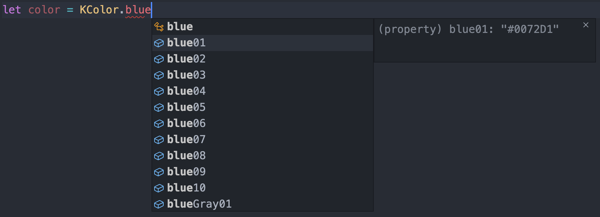

# 颜色KColor

## 资源
[视觉](http://cdp.release.ctripcorp.com/project/sketch/%E8%87%AA%E7%94%B1%E8%A1%8Cctrip%E8%A7%86%E8%A7%89%E8%AE%BE%E8%AE%A1%E8%A7%84%E8%8C%83/index.html#artboard1) 张婷 | 开发 陈思思

## 使用

```js
import { KColor } from '@ctrip/rn-koala'
KColor.blue03 // '#0086F6'，携程标准蓝
KColor.gBlue // ['#00A7FA','#0076F5']，渐变蓝
```



## 示例


