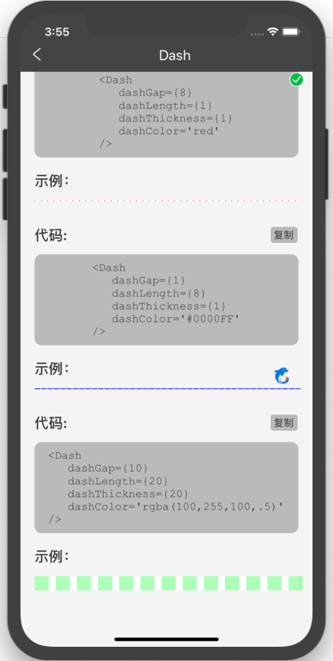

# 虚线Dash
引用包react-native-dash，[详情点击](https://www.npmjs.com/package/react-native-dash)

## 资源
开发 陈思思

## 使用
```js
import { Dash, KColor } from '@ctrip/rn-koala'
<Dash dashGap={2} dashLength={5} dashThickness={5} dashColor={KColor.blue03} />
```

## API
| 属性          | 说明          | 类型   | 默认值 | 必选 |
| ------------- | ------------- | ------ | ------ | ---- |
| dashGap       | 虚线间隙      | number | 2      | 否   |
| dashLength    | 虚线长度      | number | 2      | 否   |
| dashThickness | 虚线高度      | number | 1      | 否   |
| dashColor     | 虚线颜色      | string | 黑色   | 否   |
| dashStyle     | 虚线样式      | object |        | 否   |
| style         | container样式 | object |        | 否   |

## 示例
