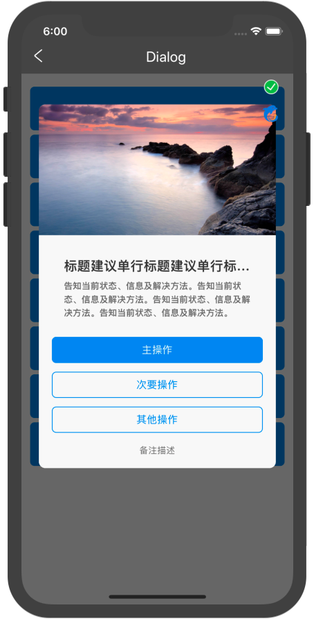

# 对话框Dialog

## 资源
[视觉](http://cds.ued.ctripcorp.com/?cat=160) 公共 | 开发 赵一

## 使用

```js
const [display, setdisplay] = useState(false)

interface Behavior{
    id?: string
    name: string
    callback?: () => void
}

display && <Dialog
    title='标题建议单行'
    onHide={() => {setdisplay(false)}}
    source={{uri:'PATH/TO/IMAGE'}}
    description='告知当前状态、信息及解决方法。'
    buttonDircetion='column'
    primaryBehavior={{
            id: '',
            name: '主操作',
            callback: () => {}
        }}
    secondaryBehavior={{
        id: '',
        name: '次要操作',
        callback: () => {}
    }}
    otherBehavior={{
        id: '',
        name: '其他操作',
        callback: () => {}
    }}
    remark='备注描述'
/>
```

## API

| 属性              | 说明         | 类型                      | 默认值        | 必选  |
| ----------------- | ------------ | ------------------------- | ------------- | ----- |
| onHide            | 关闭视图方法 | () => void                |               | true  |
| title             | 标题         | string                    | undefinde     | false |
| description       | 描述内容     | string                    |               | false |
| buttonDircetion   | 按钮排列方式 | 'column' or 'row-reverse' | 'row-reverse' | false |
| primaryBehavior   | 主按钮行为   | Behavior                  |               | true  |
| secondaryBehavior | 次要行为     | Behavior                  |               | false |
| otherBehavior     | 其他行为     | Behavior                  |               | false |
| remark            | 最下方备注   | string                    |               | false |

Behavior
|属性|说明|类型|默认值|必选|
|:--:|:--:|:--:|:--:|:--:|
|id|标签testID属性|string|`{buttonAttrName}ID`|false|
|name|按钮名称|string|-|true|
|callback|按钮回调|Function|-|false|
## 使用


