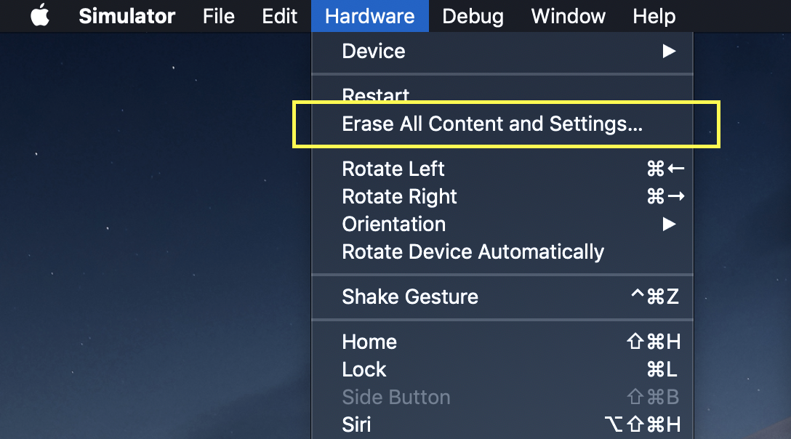

# 图标 Icon

## 资源

开发 冯申翔

## 收集规范
* 将需要添加的图标加入到crn_font_diytour_s
* 将iconfont网站上对应的代码作为name传入 比如 \&#xe038; 传入 	{ '\ue038'}即可 ([注意⚠️: react 字符串字面量直接传值无法解析特殊字符, 需要包在{}里](http://react.html.cn/docs/jsx-in-depth.html)) 查看字符串字面量部分

## 更新图标后重新加载操作

#### 替换本地./fonts/crn_font_diytour_s文件并且重新加载 具体操作  [font加载](http://books.ctripcorp.com/crn/chapter3/icon-font-intro.html)

####  清除缓存(icon有缓存, 一般每次更新icon时都需要清除缓存重新加载)
* erase setting  
* (危险操作⚠️)清除整个模拟器 删除  ~/Library/Developer/CoreSimulator/Devices

## 属性

| 属性名称        | 数据类型     | 是否必填 | 备注  |
|:-----------:|:------:|:----:|:---:|
| name        | IIcon \| string | 是    |     |
| 所有Text的其他属性 |        |      |     |


## 使用
```tsx
<Icon name="arrowTowardsRightBold" />
```

## 样式
