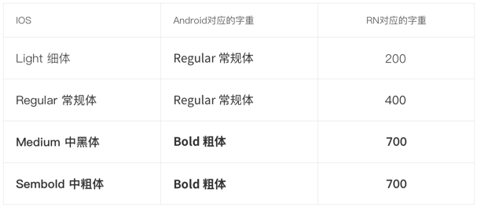
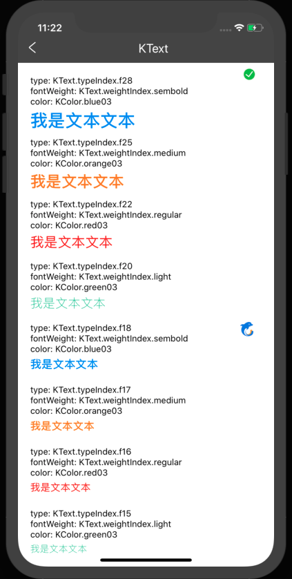

# 文本KText

## 资源
[视觉](http://cdp.release.ctripcorp.com/project/sketch/%E8%87%AA%E7%94%B1%E8%A1%8Cctrip%E8%A7%86%E8%A7%89%E8%AE%BE%E8%AE%A1%E8%A7%84%E8%8C%83/index.html#artboard2) 张婷 | 开发 陈思思

## 使用
静态属性typeIndex，映射到相应的预设样式上；静态属性weightIndex，映射到相应的预设字重上
```js
import { KText, KColor } from '@ctrip/rn-koala'
<KText type={KText.typeIndex.f12} color={KColor.blue03} fontWeight={KText.weightIndex.sembold} style={{padding: 10}}>文本内容</KText>
```

## API
| 属性       | 说明           | 类型                                               | 必选 |
| ---------- | -------------- | -------------------------------------------------- | ---- |
| type       | 文字预设样式   | obejct                                             | 否   |
| color      | 色值           | string                                             | 否   |
| fontWeight | 字重           | [两种平台字重对应表](#ios与android字重对应表)      | 否   |
| style      | 自定义样式     | TextStyle                                          | 否   |
| ...others  | 其他 Text 属性 | [参考 RN](https://reactnative.cn/docs/text/#props) | 否   |

### ios与android字重对应表


## 示例
