# 标签Label

## 资源
[视觉](http://cdp.release.ctripcorp.com/project/sketch/%E8%87%AA%E7%94%B1%E8%A1%8Cctrip%E8%A7%86%E8%A7%89%E8%AE%BE%E8%AE%A1%E8%A7%84%E8%8C%83/index.html#artboard6) 张婷 | 开发 冯申翔

## 类型(点击对应图片直接查看相关文档)

| solid                                                        | border                                                      | light                                                    | leftSolidRightBorder                                         |
| ------------------------------------------------------------ | ----------------------------------------------------------- | -------------------------------------------------------- | ------------------------------------------------------------ |
| [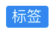](#solid) | [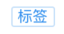](#border) | [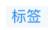](#light) | [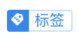](#leftsolidrightborder) |

## solid

| 属性名             | 数据类型    | 是否必填     | 备注     |
|-----------------|---------|----------|--------|
| size            | 'big' \| 'small' | 是        |        |
| enabled | *boolean* | 否 默认 true | |
| text            | *string* | 是        |        |
| backgroundColor | "red"\|"orange"\|"blue"\|"green"\| "gray" | 是 |  |

### 不同样式

| size: 'big' enabled: true                    | size: 'small' enabled: true | size: 'big' enabled: false | size: 'small' enabled: false |
| ---------------------------------------------- | -------- | -------- | ---- |
|  | 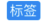 | 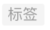 | 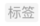 |


### 使用

```tsx
    <Label.solid
    	text='标签'
    	backgroundColor='blue'
    	size='big'
    />
```
## border

| 属性名             | 数据类型    | 是否必填     | 备注     |
|-----------------|---------|----------|--------|
| size            | 'big' \| 'small' | 是        |        |
| enabled | *boolean* | 否 默认 true | |
| text            | *string* | 是        |        |
| color | "white"\|"red"\|"orange"\|"blue"\| "green" \| "gray" \| "gold" | 是 |  |
| borderColor |  "white"\|"red"\|"orange"\|"blue"\| "green" \| "gray" \| "gold" | 是 | |

### 不同样式

| size: 'big' enabled: true                    | size: 'small' enabled: true | size: 'big' enabled: false | size: 'small' enabled: false |
| ---------------------------------------------- | -------- | -------- | ---- |
|  |  | 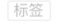 |  |


### 使用

```tsx
    <Label.border
    	text='标签'
    	color='blue'
    	size='big'
    />
```
## light

| 属性名             | 数据类型    | 是否必填     | 备注     |
|-----------------|---------|----------|--------|
| size            | 'big' \| 'small' | 是        |        |
| enabled | *boolean* | 否 默认 true | |
| text            | *string* | 是        |        |
| backgroundColor | "red"\|"orange"\|"blue"\|"green"\| "gray" | 是 |  |

### 不同样式

| size: 'big' enabled: true                    | size: 'small' enabled: true | size: 'big' enabled: false | size: 'small' enabled: false |
| ---------------------------------------------- | -------- | -------- | ---- |
|  | 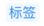 | 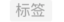 | 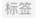 |


### 使用

```tsx
    <Label.light
    	text='标签'
    	backgroundColor='blue'
    	size='big'
    />
```
## leftSolidRightBorder

| 属性名             | 数据类型    | 是否必填     | 备注     |
|-----------------|---------|----------|--------|
| Icon | Icon | 是 | |
| size            | 'big' \| 'small' | 是        |        |
| enabled | *boolean* | 否 默认 true | |
| text            | *string* | 是        |        |
| backgroundColor | "red"\|"orange"\|"blue"\|"green"\| "gray" | 是 |  |
| color | "white"\|"red"\|"orange"\|"blue"\| "green" \| "gray" \| "gold" | 是 | |
| borderColor | "white"\|"red"\|"orange"\|"blue"\| "green" \| "gray" \| "gold" | 是 | |

### 不同样式

| size: 'big' enabled: true                    | size: 'small' enabled: true | size: 'big' enabled: false | size: 'small' enabled: false |
| ---------------------------------------------- | -------- | -------- | ---- |
|  |  | 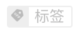 | 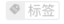 |


### 使用

```tsx
<Label.leftSolidRightBorder
	text='标签'
	color='blue'
	borderColor='blue'
	size='big'
	icon='discountFilling'
	backgroundColor='blue'
/>
```

## 样式


