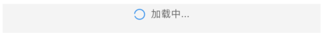

# 加载Loading

## 资源
[视觉](http://cdp.release.ctripcorp.com/project/sketch/[自由行组件库]Loading加载/) 张婷 | 开发 冯申翔

## 类型(点击对应图片直接查看相关文档)
|                    partialLoading_module                     |                     partialLoading_image                     |                        augmentLoading                        |
| :----------------------------------------------------------: | :----------------------------------------------------------: | :----------------------------------------------------------: |
| [](#partialloading-module) | [](#partialloading-image) | [](#augmentloading) |

## partialLoading_module
|       属性名称       | 数据类型 | 是否必填 | 备注 |
| :------------------: | :------: | :------: | ---- |
| textUnderLoadingIcon | *string* |    否    |      |

### 使用
```tsx
<Loading.partialLoading_module
	textUnderLoadingIcon='加载中...'
/>
```

## partialLoading_image
| 属性名称                 | 数据类型                          | 是否必填 | 备注 |
| ------------------------ | --------------------------------- | -------- | ---- |
| status                   | "pending" \|  "fail" \| "success" | 是       |      |
| textUnderLoadingFailIcon | *string*                          | 否       |      |

### 使用
```tsx
<Loading.partialLoading_image
	status='pending'
	textUnderLoadingFailIcon='暂无图片'
/>
```


## augmentLoading

| 属性名称              | 数据类型                                       | 是否必填 | 备注                                 |
| --------------------- | ---------------------------------------------- | -------- | ------------------------------------ |
| status                | "pending" \| "fail" \| "success" \| "finished" | 是       |                                      |
| pressOnFail           | () **=>** *void*                               | 是       |                                      |
| failTestID            | *string*                                       | 否       |                                      |
| pendingIndicatingText | *string*                                       | 否       | pending文案 默认为 *加载中...*       |
| failIndicatingText    | *string*                                       | 否       | fail文案 默认为 *刷新失败, 点击重试* |
| pendingIndicatingText | *string*                                       | 否       | finished文案 默认为 *没有更多了*     |

### 使用

```tsx
<Loading.augmentLoading
	pressOnFail={function pressOnFail() {}}
	status='pending'
/>
```

## 样式

