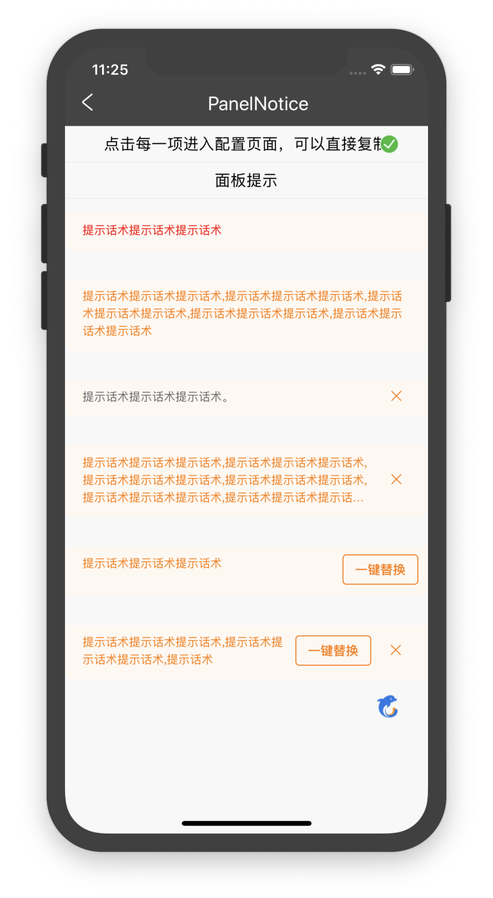

# 面板提示PanelNotice

## 资源
[视觉规范中C2、C3](http://cdp.release.ctripcorp.com/project/sketch/%E4%BF%A1%E6%81%AF%E6%8F%90%E7%A4%BA%E5%88%86%E7%BA%A7UI%E8%A7%84%E8%8C%83/index.html#artboard2) 张婷 | 开发 王亚男

## 使用

```js
import { PanelNotice } from '@ctrip/rn-koala'

<PanelNotice  color = 'level1' messageArray = {[{"message":"提示话术提示话术提示话术,提示话术提示话术提示话术",onClose:() => {alert('wa')},button:{"title":"次要按钮"}}]}  />
```

## API

| 属性      | 说明           | 类型                                               | 默认值 | 必选 |
| --------- | -------------- | -------------------------------------------------- | ------ | ---- |
| color     | 色值           | string(支持level1/level2/自定义)                 |    level1    |      |
| messageArray | 提示数组 | [messageArray](#messageArray) |        |      |

#### messageArray

```
messageArray: Array<{ 
        message?: string // 要展示的信息
        isLimitRow?: boolean // 是否限制行数
        hasLimitRow?: number // 限制几行
        onClose?: () => void // 是和否支持关闭，方法为空则不展示
        button?: {
            // 按钮名称
            title?: string
            onClick: () => void
        }
}>       
```

## 示例


