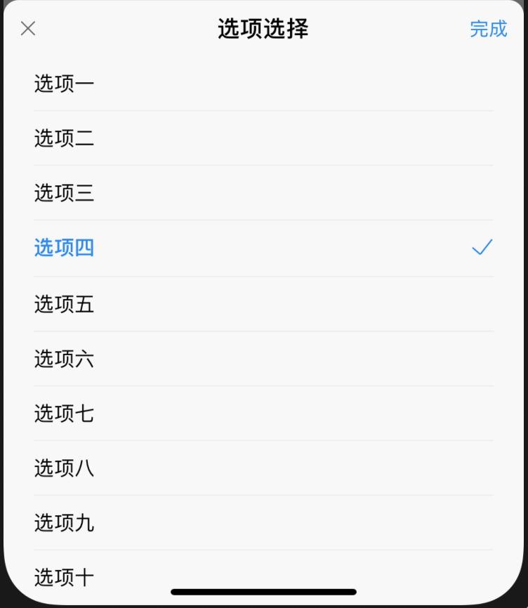

# 单选浮层RadioView

## 资源
[视觉](http://cds.ued.ctripcorp.com/?cat=274) 公共 | 开发 赵一

## 使用

```js
const [display, setdisplay] = useState(false)

display && (
    <RadioView
        title="选项选择"
        onHide={() => {
            setdisplay(false)
        }}
        needCloseBtn={true}
        needSubmitBtn={true}
        onSubmit={() => {}}
        renderList={renderList}
        currentName={currentName}
        onPressItem={(item) => {
            setCurrentName(item.name)
            Alert.alert('onPressItem')
        }}
    />
)
```

## API

```js
interface RenderItem {
    name: string
    [name: string]: any
}
type RenderList = RenderItem[]

```

| 属性          | 说明             | 类型       | 默认值    | 必选  |
| ------------- | ---------------- | ---------- | --------- | ----- |
| onHide        | 关闭视图方法     | () => void |           | true  |
| title         | 标题             | string     | undefinde | false |
| needCloseBtn  | 是否需要关闭按钮 | boolean    | true      | false |
| needSubmitBtn | 是否需要确定按钮 | boolean    | false     | false |
| onSubmit      | 提交按钮点击回调 | () => void | false     | false |
| renderList    | 需要渲染的选项   | RenderList |           | true  |
| currentName   | 当前选中的       | string     |           | true  |
| onPressItem   | 单个元素点击处理 | () => void |           | false |

## 使用


