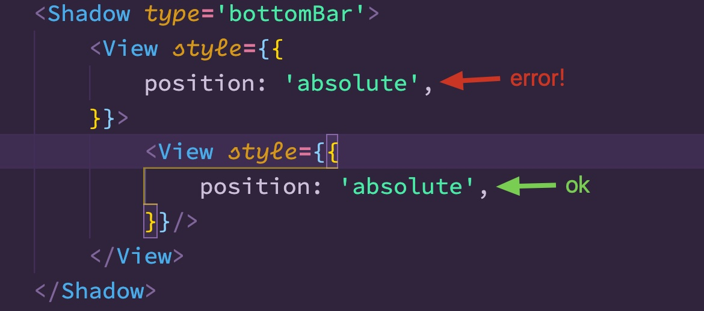
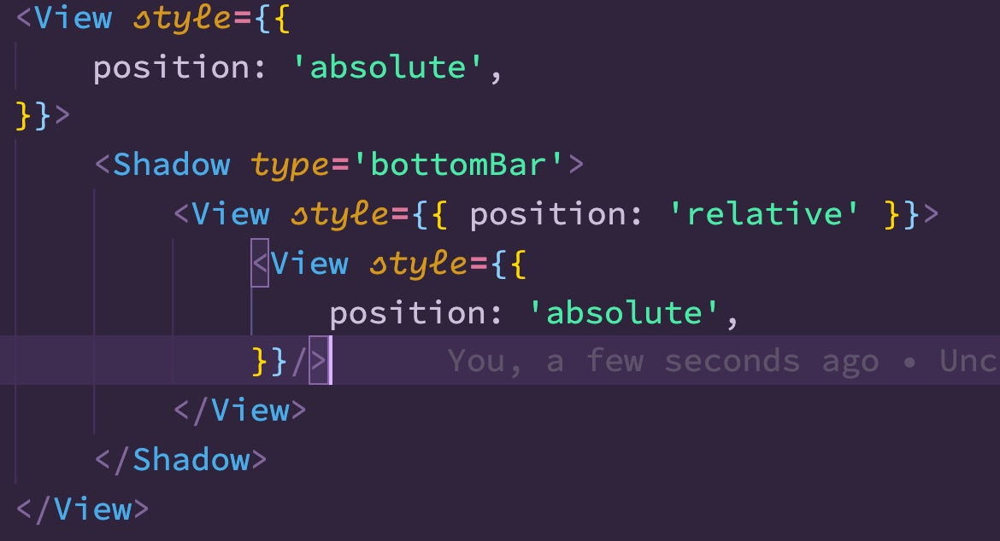
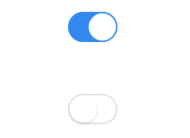
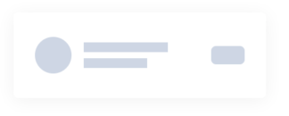
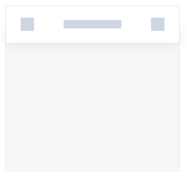
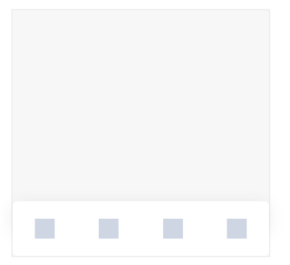

# 阴影Shadow

## 资源
 [视觉](http://cdp.release.ctripcorp.com/project/sketch/自由行ctrip视觉设计规范/index.html#artboard5)  张婷 | 开发 冯申翔

## 坑点

### 1.组件内部第一层无法使用absolute进行定位



shadow使用了另外一层带有阴影的组件藏在真正的组件后面来实现效果, 顶层会使用绝对定位来将真正带有shadow的组件藏在后面, 如果使用的时候在最顶层也使用了绝对定位可能会失去效果

使用这种2层层叠的效果是因为android里面没有对应的shadow效果, 安卓现在可以使用[evaluation](https://developer.android.com/reference/android/support/test/espresso/web/model/Evaluation)来实现近似效果

### 解决方案:

将绝对定位移到shadow外层即可



### 2. shadow的borderRadius需要 和内部的shadowRadius一致

shadow是重叠的, 如果内外shadowRadius不一致, 重叠在后面就露出了


## 属性:

|   属性名称   |                           数据类型                           |     是否必填      | 备注     |
| :----------: | :----------------------------------------------------------: | :---------------: | -------- |
|     type     | 'switch'   'listCard'  'topBar' 'bottomBar'  'detailCardOrFloatingButton'  |        是         |          |
|   children   |                         JSX.Element                          |        是         |          |
| shadowColor  |                         IColorValue                          | 否 默认 '#000000' |          |
|    height    |                           *number*                           |     否 默认0      | 初始高度 |
|    width     |                           *number*                           |     否 默认0      | 初始宽度 |
| borderRadius |                           *number*                           |     否 默认0      |          |

### 使用
```tsx
<Shadow
	type='switch'
>
	<View style={{ borderRadius: 2, width: 100, height: 100, padding: 5, backgroundColor: 'white', alignItems: 'flex-end', justifyContent: 'flex-end' }} />
</Shadow>
```

## 样式

