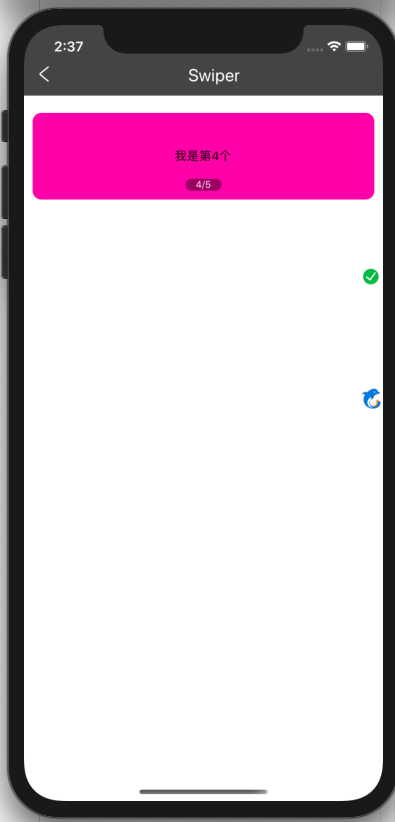

# 轮播图Swiper
引用包react-native-swiper，[详情点击](https://github.com/leecade/react-native-swiper)

## 资源
开发 陈思思

## 使用
```js
import { Swiper } from '@ctrip/rn-koala'
<Swiper
    renderPagination={(index, total, context) => {
        return (
            <View style={styles.wrap}>
                <View style={styles.container}>
                    <Text style={styles.text}>
                        <Text style={styles.text}>
                            
                            {index + 1}
                        </Text>
                        /{total}
                    </Text>
                </View>
            </View>
        )
    }}
>
    {_.map(arr, (k, v) => {
        return (
            <Shadow key={v} type="listCard">
                <View style={{ marginHorizontal:10, height: 100, backgroundColor: '#FF00ab', borderRadius: 10, justifyContent: 'center', alignItems: 'center'}}>
                    <Text>我是第{v+1}个</Text>
                </View>
            </Shadow>
        )
    })}
</Swiper>
```

## API
| 属性       | 说明               | 类型    | 默认值 | 必选 |
| ---------- | ------------------ | ------- | ------ | ---- |
| horizontal | 水平滚动或垂直滚动 | boolean | true   | 否   |
| loop       | 是否循环           | boolean | true   | 否   |
|index|初始图片索引|number|0|否|
|showsButtons|是否显示控制按钮|boolean|false|否|
|buttonWrapperStyle|自定义控制按钮样式|style|false|否|
|autoplay|是否自动播放|boolean|false|否|
|autoplayTimeout|自动播放延时时间|number|false|否|
|onIndexChanged|切换图片时的回调|func||否|
|renderPagination|自定义小圆点样式|func||否|
更多属性，[点击参考](https://github.com/leecade/react-native-swiper)

## 示例
