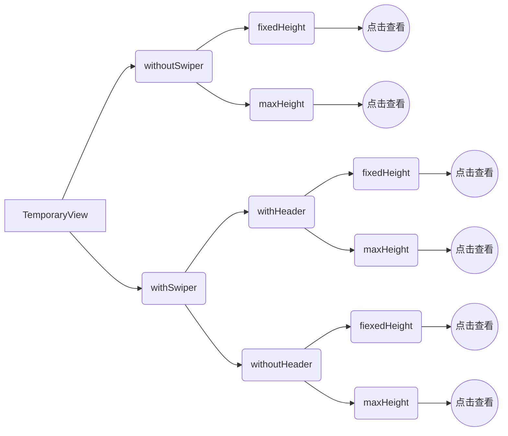

# 临时窗口 TemporaryView

## 资源

[交互](http://cdp.release.ctripcorp.com/project/sketch/自由行规范-临时窗口/index.html) 唐晟 开发 冯申翔


## 使用方法

1. 使用 injectTemporaryView2PageHOC作为一个高阶组件, 包裹住原先的Page
```tsx
import {injectTemporaryView2PageHOC} from '@ctrip/rn-koala'

export default injectTemporaryView2PageHOC(YourPage)
```

2. 在页面的任意位置使用TemporaryView即可

```tsx
<TemporaryView.withoutSwiper.maxHeight
  visible
  onClose={() => { setVisible(false); }}
  maxHeight={500}
  header={{
    title: '临时弹窗',
      close: {},
        submit: {},
  }}
  >
  <Children />
</TemporaryView.withoutSwiper.maxHeight>
```

   

## 注意点

1. 不要在内部使用Vertical ScrollView 或其他纵向滑动组件[👉可以在临时窗口使用ScrollView吗](#问-可以在临时窗口使用scrollview吗)

2. 不要同时打开2个及以上的临时窗口, 技术上没有支持到, UX上交互也有问题

   

## ⚠️未能支持点

andorid中包含swiper的情景不支持拖拽关闭功能 具体原因查看 [👉手势系统](#手势系统)

   

## 类型(点击对应节点直接查看相关文档)





## withoutSwiper fixedHeight

| 名称                   | 类型                                                         | 是否必传     | 备注                             |
| ---------------------- | ------------------------------------------------------------ | ------------ | -------------------------------- |
| visible                | *boolean*                                                    | 是           |                                  |
| backDropDismissEnabled | *boolean*                                                    | 否 默认 true | 点击蒙层阴影是否关闭             |
| isAnimatedClose        | *boolean*                                                    | 否 默认 true | 是够启用关闭动画                 |
| scrollToProps          | { y: number; animated?: boolean }                            | 否           | 滑动参数, 传入执行ScrollView滑动 |
| children               | [JSX.Element](https://stackoverflow.com/questions/58123398/when-to-use-jsx-element-vs-reactnode-vs-reactelement) | 是           |                                  |
| onClose                | () => *void*                                                 | 否           |                                  |
| bottomChildren         | [JSX.Element](https://stackoverflow.com/questions/58123398/when-to-use-jsx-element-vs-reactnode-vs-reactelement) | 否           |                                  |
| offsetTop              | [Animated.Value](https://reactnative.dev/docs/animated)      | 否           |                                  |
| header                 | [IHeader](#iheader)                                          | 是           |                                  |
| fixedHeightMode        | [IFixedHeightMode](#ifixedheightmode)                        | 是           |                                  |


### 使用

```tsx
<TemporaryView.withoutSwiper.fixedHeight
  visible
  onClose={() => { setVisible(false); }}
  fixedHeightMode='tall'
  header={{
    	title: '临时弹窗',
     	close: {},
      submit: {},
  }}
>
	<Children />
</TemporaryView.withoutSwiper.fixedHeight>
```

## withoutSwiper maxHeight


| 名称                   | 类型                                                         | 是否必传     | 备注                             |
| ---------------------- | ------------------------------------------------------------ | ------------ | -------------------------------- |
| visible                | *boolean*                                                    | 是           |                                  |
| backDropDismissEnabled | *boolean*                                                    | 否 默认 true | 点击蒙层阴影是否关闭             |
| isAnimatedClose        | *boolean*                                                    | 否 默认 true | 是够启用关闭动画                 |
| scrollToProps          | { y: number; animated?: boolean }                            | 否           | 滑动参数, 传入执行ScrollView滑动 |
| children               | [JSX.Element](https://stackoverflow.com/questions/58123398/when-to-use-jsx-element-vs-reactnode-vs-reactelement) | 是           |                                  |
| onClose                | () => *void*                                                 | 否           |                                  |
| bottomChildren         | [JSX.Element](https://stackoverflow.com/questions/58123398/when-to-use-jsx-element-vs-reactnode-vs-reactelement) | 否           |                                  |
| offsetTop              | [Animated.Value](https://reactnative.dev/docs/animated)      | 否           |                                  |
| header                 | [IHeader](#iheader)                                          | 是           |                                  |
| maxHeight              | *number*                                                     | 是           |                                  |

```tsx
<TemporaryView.withoutSwiper.maxHeight
  visible
  onClose={() => { setVisible(false); }}
  maxHeight={500}
  header={{
    	title: '临时弹窗',
     	close: {},
      submit: {},
  }}
>
	<Children />
</TemporaryView.withoutSwiper.maxHeight>
```


## withSwiper withHeader fixedHeight

| 名称                   | 类型                                                         | 是否必传     | 备注                             |
| ---------------------- | ------------------------------------------------------------ | ------------ | -------------------------------- |
| visible                | *boolean*                                                    | 是           |                                  |
| backDropDismissEnabled | *boolean*                                                    | 否 默认 true | 点击蒙层阴影是否关闭             |
| isAnimatedClose        | *boolean*                                                    | 否 默认 true | 是够启用关闭动画                 |
| scrollToProps          | { y: number; animated?: boolean }                            | 否           | 滑动参数, 传入执行ScrollView滑动 |
| children               | [JSX.Element](https://stackoverflow.com/questions/58123398/when-to-use-jsx-element-vs-reactnode-vs-reactelement) | 是           |                                  |
| onClose                | () => *void*                                                 | 否           |                                  |
| bottomChildren         | [JSX.Element](https://stackoverflow.com/questions/58123398/when-to-use-jsx-element-vs-reactnode-vs-reactelement) | 否           |                                  |
| offsetTop              | [Animated.Value](https://reactnative.dev/docs/animated)      | 否           |                                  |
| swiper                 | [ISwiper](#iswiper)                                          | 是           |                                  |
| header                 | [ISwiperHeader](#iswiperheader)                              | 是           |                                  |
| fixedHeightMode        | [IFixedHeightMode](#ifixedheightmode)                        | 是           |                                  |

```tsx
<TemporaryView.withSwiper.withHeader.fixedHeight
  visible
  onClose={() => { setVisible(false); }}
  fixedHeightMode='tall'
  header={{
    	title: '临时弹窗',
     	close: {},
      submit: {},
  }}
  swiper={{
    imageSourceList: [],
  }}
>
	<Children />
</TemporaryView.withSwiper.withHeader.fixedHeight>
```


## withSwiper withHeader maxHeight

| 名称                   | 类型                                                         | 是否必传     | 备注                             |
| ---------------------- | ------------------------------------------------------------ | ------------ | -------------------------------- |
| visible                | *boolean*                                                    | 是           |                                  |
| backDropDismissEnabled | *boolean*                                                    | 否 默认 true | 点击蒙层阴影是否关闭             |
| isAnimatedClose        | *boolean*                                                    | 否 默认 true | 是够启用关闭动画                 |
| scrollToProps          | { y: number; animated?: boolean }                            | 否           | 滑动参数, 传入执行ScrollView滑动 |
| children               | [JSX.Element](https://stackoverflow.com/questions/58123398/when-to-use-jsx-element-vs-reactnode-vs-reactelement) | 是           |                                  |
| onClose                | () => *void*                                                 | 否           |                                  |
| bottomChildren         | [JSX.Element](https://stackoverflow.com/questions/58123398/when-to-use-jsx-element-vs-reactnode-vs-reactelement) | 否           |                                  |
| offsetTop              | [Animated.Value](https://reactnative.dev/docs/animated)      | 否           |                                  |
| swiper                 | [ISwiper](#iswiper)                                          | 是           |                                  |
| header                 | [ISwiperHeader](#iswiperheader)                              | 是           |                                  |
| maxHeight              | *number*                                                     | 是           |                                  |

```tsx
<TemporaryView.withSwiper.withHeader.maxHeight
  visible
  onClose={() => { setVisible(false); }}
  maxHeight={500}
  header={{
    	title: '临时弹窗',
     	close: {},
      submit: {},
  }}
  swiper={{
    imageSourceList: [],
  }}
>
	<Children />
</TemporaryView.withSwiper.withHeader.maxHeight>
```


## withSwiper withoutHeader fixedHeight

| 名称                   | 类型                                                         | 是否必传     | 备注                             |
| ---------------------- | ------------------------------------------------------------ | ------------ | -------------------------------- |
| visible                | *boolean*                                                    | 是           |                                  |
| backDropDismissEnabled | *boolean*                                                    | 否 默认 true | 点击蒙层阴影是否关闭             |
| isAnimatedClose        | *boolean*                                                    | 否 默认 true | 是够启用关闭动画                 |
| scrollToProps          | { y: number; animated?: boolean }                            | 否           | 滑动参数, 传入执行ScrollView滑动 |
| children               | [JSX.Element](https://stackoverflow.com/questions/58123398/when-to-use-jsx-element-vs-reactnode-vs-reactelement) | 是           |                                  |
| onClose                | () => *void*                                                 | 否           |                                  |
| bottomChildren         | [JSX.Element](https://stackoverflow.com/questions/58123398/when-to-use-jsx-element-vs-reactnode-vs-reactelement) | 否           |                                  |
| offsetTop              | [Animated.Value](https://reactnative.dev/docs/animated)      | 否           |                                  |
| swiper                 | [ISwiper](#iswiper)                                          | 是           |                                  |
| fixedHeightMode        | [IFixedHeightMode](#ifixedheightmode)                        | 是           |                                  |

```tsx
<TemporaryView.withSwiper.withHeader.fixedHeight
  visible
  onClose={() => { setVisible(false); }}
  fixedHeightMode='tall'
  swiper={{
    imageSourceList: [],
  }}
>
	<Children />
</TemporaryView.withSwiper.withHeader.fixedHeight>
```


## withSwiper withoutHeader maxHeight

| 名称                   | 类型                                                         | 是否必传     | 备注                             |
| ---------------------- | ------------------------------------------------------------ | ------------ | -------------------------------- |
| visible                | *boolean*                                                    | 是           |                                  |
| backDropDismissEnabled | *boolean*                                                    | 否 默认 true | 点击蒙层阴影是否关闭             |
| isAnimatedClose        | *boolean*                                                    | 否 默认 true | 是够启用关闭动画                 |
| scrollToProps          | { y: number; animated?: boolean }                            | 否           | 滑动参数, 传入执行ScrollView滑动 |
| children               | [JSX.Element](https://stackoverflow.com/questions/58123398/when-to-use-jsx-element-vs-reactnode-vs-reactelement) | 是           |                                  |
| onClose                | () => *void*                                                 | 否           |                                  |
| bottomChildren         | [JSX.Element](https://stackoverflow.com/questions/58123398/when-to-use-jsx-element-vs-reactnode-vs-reactelement) | 否           |                                  |
| offsetTop              | [Animated.Value](https://reactnative.dev/docs/animated)      | 否           |                                  |
| swiper                 | [ISwiper](#iswiper)                                          | 是           |                                  |
| maxHeight              | *number*                                                     | 是           |                                  |

```tsx
<TemporaryView.withSwiper.withHeader.maxHeight
  visible
  onClose={() => { setVisible(false); }}
  maxHeight={500}
  swiper={{
    imageSourceList: [],
  }}
>
	<Children />
</TemporaryView.withSwiper.withHeader.maxHeight>
```


### IHeader

| 属性   | 类型                | 是否必传 | 备注 |
| ------ | ------------------- | -------- | ---- |
| title  | *string*            | 是       |      |
| close  | [IClose](#iclose)   | 否       |      |
| submit | [ISumbit](#isubmit) | 否       |      |


### ISwiperHeader

| 属性  | 类型              | 是否必传 | 备注 |
| ----- | ----------------- | -------- | ---- |
| title | *string*          | 是       |      |
| close | [IClose](#iclose) | 否       |      |


### IClose

| 属性      | 类型                                                       | 是否必传         | 备注 |
| --------- | ---------------------------------------------------------- | ---------------- | ---- |
| iconName  | *string*                                                   | 否 默认为 cross  |      |
| iconStyle | [TextStyle](https://reactnative.dev/docs/text-style-props) | 否               |      |
| onPress   | () => void                                                 | 否 默认为onClose |      |
| testID    | *string*                                                   | 否               |      |


### ISubmit

| 属性      | 类型         | 是否必传         | 备注 |
| --------- | ------------ | ---------------- | ---- |
| text      | string       | 否 默认完成      |      |
| textStyle | TextStyle    | 否               |      |
| onPress   | () => *void* | 否 默认为onClose |      |
| testID    | *string*     | 否               |      |


### IFixedHeightMode

| 类型     | 值   |
| -------- | ---- |
| ‘taller’ | 94%  |
| ‘tall’   | 80%  |
| ‘middle’ | 60%  |
| ‘short’  | 40%  |


### ISwiper

| 属性            | 类型                                                         | 是否必传 | 备注 |
| --------------- | ------------------------------------------------------------ | -------- | ---- |
| imageSourceList | *ImageSourcePropType*[]                                      | 是       |      |
| renderImage     | ({ item: *ImageSourcePropType* , index: number }) => JSX.Element | 否       |      |


## 问答

### 问: TempararyView可以放在任意位置吗?

### 答: 可以

**TempararyView内部实现使用了[React Portal](https://zh-hans.reactjs.org/docs/portals.html), 不管放在什么地方都不会影响呈现, 需要在每个页面上包下inJectTemporaryView2PageHOC高阶组件**


### 问: 为什么使用map的形式提供组件

### 答:

1. **通过map的形式更加确定应用场景**

2. **参数更加固定, 避免调用和处理可能的错误**

**比如 参数 a 和 b 是互斥的, 如果同时设置了a, b时得出来的结果可能违背调用者或者提供者的想法, 也很可能造成错误, 尽可能消除这种可能**

3. **vscode 参数提示更加清楚**


### 问: 为什么安卓中的带有Swiper的临时窗口不能提供下拉关闭功能

### 答: 手势识别可能冲突, 实现效果差, 暂不支持

1. 下拉操作需要外部的监听调整

2. 在一个手势内无法进行重新绑定

3. RN实现的安卓的手势识别判定不太正确, 监听和绑定是一体的

   

综上: 滑动Swiper时很容易将滑动操作识别为下拉操作, 因为Swiper在最上方, 这个时候正好也满足下拉的监听条件, 两个手势识别形成冲突


### 问: 可以在临时窗口使用ScrollView吗

### 答: 不可以, 可以传入ScrollView 的props来自定义ScrollView的功能

1. 手势识别问题, 两层ScrollView会产生手势交接的问题, 下拉效果和滑动效果形成冲突
2. TemporaryView支持除了 scrollEnabled horizontal以外的其他ScrollViewProps


### 问: 可以支持动画吗和滑动吗

### 答: 可以

1. 动画用offsetTop参数, 是一个Animated.Value类型
2. 滑动支持, 更改scrollToProps参数即可


## 实现方案

### 1. 容器问题:

#### 问题陈述: 不同的容器会自带功能, 正确选择容器有助于直接解决问题

#### 具体条件:
1. 位置随意, 临时窗口如果一定要放在最上层, 则会导致lifting state up, 需要将窗口相关的数据放到上层进行管理, 很大程度上可能要改写页面的状态内容

2. 性能良好(不能消耗太多计算, 存储性能)

3. 包含backAndroid的功能

4. 支持更新

5. 可以在里面弹出modal或者page

2, 4是相互斥的, 支持更新则性能会有损耗

#### 选项: Modal, Page, View

#### 结论:  View是目前唯一可行方案


#### Modal

| 1    | 2              | 3    | 4    | 5                                                            |
| ---- | -------------- | ---- | ---- | ------------------------------------------------------------ |
| ✔︎    | ◼︎ 会有一定损耗 | ✔︎    | ✔︎    | ✘  [react native的问题, 没有解决方案](https://github.com/react-native-community/react-native-modal#i-cant-show-multiple-modals-at-the-same-time) |


#### Page

| 1    | 2    | 3    | 4                                                            | 5    |
| ---- | ---- | ---- | ------------------------------------------------------------ | ---- |
| ✔︎    | ✔︎    | ✔︎    | ✘(Page最初设计的目的就是占据所有的资源, 无法和之前的页面进行交互, 没有解决方案) | ✔︎    |


#### View

| 1                                                            | 2              | 3    | 4    | 5    |
| ------------------------------------------------------------ | -------------- | ---- | ---- | ---- |
| ◼︎ [使用React Portal可以将任意节点进行转移](https://zh-hans.reactjs.org/docs/portals.html) | ◼︎ 会有一定损耗 | ✔︎    | ✔︎    | ✔︎    |


### 2. 功能问题:

#### 问题陈述: 支持拖拽关闭弹窗

#### 具体条件:

1. 支持拖拽关闭

2. 正常滑动不会触发拖拽效果

   

#### 选项: 

1. 使用2个stickyHeaderIndices

2. 2层ScrollView

3. ScrollView结合responder

#### 已知都要解决的问题

首先以上的解决方案都需要包含一层ScrollView或类似的组件(FlatList, ListView, SectionList等)

所以 如果内部包含ScrollView的时候 可能会有手势识别交接的问题, nested ScrollView内部有默认的手势识别和交接方案

#### 结论: 选项3

##### 选项1

| 1    | 2                                                            |
| ---- | ------------------------------------------------------------ |
| ✔︎    | ◼︎ 需要缩小整个scrollView第一个组件的高度, 然后使用scrollTo来回到那个位置, 然后再响应, 在遇到拖拽下拉的情形, 则需要通过上述操作的逆操作来实现, 效果可能有卡顿 |


##### 选项2

| 1                  | 2                                                            |
| ------------------ | ------------------------------------------------------------ |
| ◼︎ 内部手势识别问题 | ◼︎ 需要缩小整个scrollView第一个组件的高度, 然后使用scrollTo来回到那个位置, 然后再响应, 在遇到拖拽下拉的情形, 则需要通过上述操作的逆操作来实现, 效果可能有卡顿 |


##### 选项3

| 1                  | 2                                                            |
| ------------------ | ------------------------------------------------------------ |
| ◼︎ [在有多个识别手势的模块时, 在安卓上出现问题](#手势系统) | ✔︎ |


### 3.管理问题

#### 问题陈述: 理解和书写的复杂度低

1. 使用 [react portal](https://zh-hans.reactjs.org/docs/portals.html) 使得临时窗口的位置随意摆放

   为什么组件位置随意放置比较重要?

   若组件位置固定, 则对应的参数也需要固定, 可能某次需求是在页面加入一个弹窗, 但是里面的参数在一个层级很深的组件里面, 需要[状态提升](#https://zh-hans.reactjs.org/docs/lifting-state-up.html), 或者使用redux、mobx或者记录到缓存中提取成公共变量, 无论哪一种方案都不简洁, 而且会极大程度的改写之前的参数体系

2. 使用BackHandler使得内部直接处理安卓后退按钮的问题


## 手势系统

web和手机端的事件系统一样 支持 captrue 和 bubble 类型, 是一个洋葱模型, ios和android都实现了这个模型

但是ios和androud的手势识别系统有差异, 具体可以看[react-native-gesture-handler](https://www.youtube.com/watch?v=V8maYc4R2G0) 和rn [Gesture Responder System](https://reactnative.dev/docs/gesture-responder-system.html)

