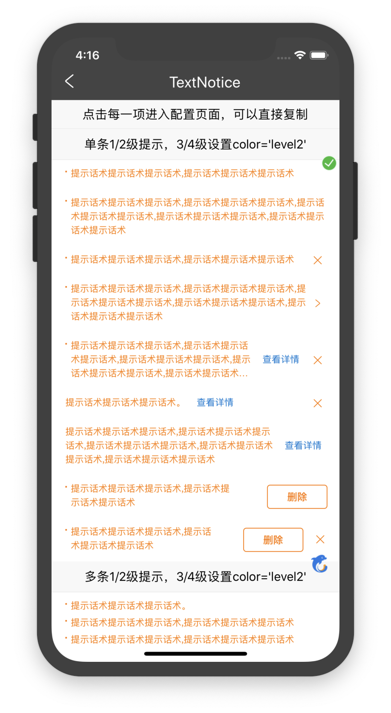

# 页面提示TextNotice

## 资源
[视觉规范中A、B](http://cdp.release.ctripcorp.com/project/sketch/%E4%BF%A1%E6%81%AF%E6%8F%90%E7%A4%BA%E5%88%86%E7%BA%A7UI%E8%A7%84%E8%8C%83/index.html#artboard2) 张婷 | 开发 王亚男

## 使用

```js
import { TextNotice } from '@ctrip/rn-koala'

<TextNotice  hasLeftPoint = {true}  color = 'level1' button = {"title":"次要按钮"}  onClose = {function onClose() {alert('wa');}}  messageArray = {[{"message":"提示话术提示话术提示话术,提示话术提示话术提示话术"}]}  />
```

## API

| 属性      | 说明           | 类型                                               | 默认值 | 必选 |
| --------- | -------------- | -------------------------------------------------- | ------ | ---- |
| leftIconType     |    左边符号类型    | 'Dot' | 'Information'                        |        |      |
| color     | 色值           | string(支持level1/level2/自定义)                 |    level1    |      |
| backgroundColor     | 背景色          | 自定义                 |    white    |      |
| onJump    | 是否支持跳转       | [onJump](#onJump)                                            |   |      |
| onClose     | 是否支持关闭     | ()=>{}                                                |        |      |
| button | 是否支持次要按钮 | [button](#button) |        |      |
| messageArray | 提示数组 | [messageArray](#messageArray) |        |      |
#### button

```
button: {                  
    title?: string,          
    onClick: () => void
} 
```

#### onJump
```
是否支持跳转，方法为空则不展示，当isLimitRow=true的时候必传此函数，用于可能因限制行数出现箭头的跳转
```

#### messageArray

```
messageArray: Array<{ 
        message?: string             // 要展示的信息
        isLimitRow?: boolean          //是否限制行数, 如果配置为true, 单条默认三行截断，多条单行截断，并且最多展示三条
        detailText?: string           // 查看详情文本配置
        onShowDetail?:() => void     // 是否支持详情，方法为空则不展示
}>       
```

## 示例


